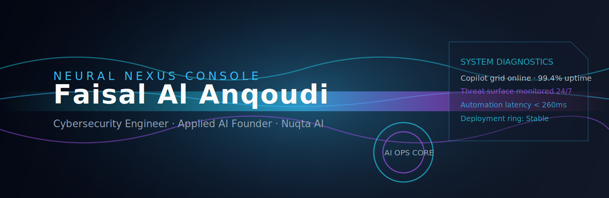

<!-- Faisal Al Anqoudi · Neural Nexus README -->

<p align="center">
  
</p>

<p align="center">
  <b>Cybersecurity Engineer · Applied AI Founder · Builder of Nuqta AI</b><br />
  Designing sovereign intelligence systems that blend Arabic-first experiences with measurable defensive resilience.
</p>

<p align="center">
  <a href="mailto:faisal@nuqtai.com"></a>
  <a href="https://linkedin.com/in/anqoudi"></a>
  <a href="https://github.com/anqoudi"></a>
  <a href="https://nuqtai.com"></a>
</p>

---

## ⚡ Command Deck

| Signal | Details |
| --- | --- |
| **Current Mission** | Scaling Nuqta AI from prototype copilots into enterprise-grade assistants, WhatsApp agents, and automation fabrics for Oman’s leading teams. |
| **Specialization** | Cyber defense engineering, applied AI design, multilingual product operations, and automation-first service delivery. |
| **Active Zones** | Muscat · Remote GCC collaborations · Hackathons and innovation programs (GeoTech, Wix Summit, Injaz Oman). |
| **Differentiator** | Fuses security-by-design, measurable telemetry, and Arabic UX into every deployment, from SOC runbooks to customer-facing bots. |

---

## 🧠 Strategic Operating Layers

<table>
  <tr>
    <td width="33%" valign="top">
      <h4 align="center">Cognitive Systems</h4>
      <p><strong>Scope:</strong> Retrieval-augmented copilots, knowledge vaults, AI-driven help desks.<br /><strong>Stack:</strong> LangChain · OpenAI · Gemini · Supabase · n8n.</p>
    </td>
    <td width="33%" valign="top">
      <h4 align="center">Cyber Fusion</h4>
      <p><strong>Scope:</strong> Threat hunting, phishing simulations, SOC automation, purple-team labs.<br /><strong>Toolkit:</strong> Burp Suite · Nessus · Metasploit · Wireshark · Nmap.</p>
    </td>
    <td width="33%" valign="top">
      <h4 align="center">Product Orchestration</h4>
      <p><strong>Scope:</strong> SaaS control centers, CI/CD pipelines, multi-cloud rollouts.<br /><strong>Stack:</strong> Next.js · React · Tailwind CSS · Docker · Vercel · Hostinger VPS.</p>
    </td>
  </tr>
</table>

---

## 🚀 Signature Deployments

| Initiative | Outcome | Core Tech |
| --- | --- | --- |
| **Nuqta AI Control Center** | Omni-channel AI assistants and WhatsApp automation powering SMB growth with Arabic-first UX. | Next.js · LangChain · Supabase · n8n |
| **Dahih Conversational Agent** | Tourism + civic knowledge bot answering in colloquial Omani Arabic with real-time retrieval. | OpenAI · Automapi · WhatsApp Cloud API |
| **CyberMirror 2.0** | Enterprise phishing simulation arena with analytics on human resilience and response speed. | Flask · Python · SQLite · Docker |
| **Learnz Plus** | AI tutoring companion that personalizes coursework journeys for students across Oman. | Expo · Firebase · Gemini API |
| **VibeCoding Workshops** | Rapid prototyping bootcamps guiding students from ideation to MVP in 48 hours. | React · Node.js · Supabase |

---

## 🎯 Momentum & Recognition

- 🥉 **GeoTech Innovation Challenge** – Delivered geospatial AI intelligence with Al-Ruya.
- 🏆 **Injaz Oman & Wix Summit 2025** – Showcased Nuqta AI omni-channel automation platform.
- 🤝 **Al-Anqa Space & Technologies** – Mentorship on scaling secure AI ventures.
- 🎓 **Middle East College** – Cybersecurity Engineering (Class of 2025).

---

## 🛠️ Systems Stack

<details open>
  <summary><strong>Languages & Frameworks</strong></summary>
  <p>Python · JavaScript · TypeScript · SQL · Bash · Next.js · React · Tailwind CSS.</p>
</details>

<details open>
  <summary><strong>AI & Automation</strong></summary>
  <p>LangChain · OpenAI API · Google Gemini · Supabase Vector · Automapi · n8n.</p>
</details>

<details open>
  <summary><strong>Cybersecurity Toolkit</strong></summary>
  <p>Burp Suite · Nessus · Metasploit · Wireshark · Nmap · Kali Linux.</p>
</details>

<details open>
  <summary><strong>Ops & Productivity</strong></summary>
  <p>Docker · Vercel · Hostinger VPS · GitHub Actions · Cursor AI · VS Code.</p>
</details>

---

## 📡 Live Telemetry Deck

<p align="center">
  
</p>

<p align="center">
  
</p>

<p align="center">
  
</p>

> _Telemetry powered by Vercel-hosted profile summary cards, Readme Activity Graph, and Streak Stats for reliable, auto-refreshing insights._

---

## 🧭 Operating Protocol

```json
{
  "identity": "Faisal Al Anqoudi",
  "roles": ["Cybersecurity Engineer", "Applied AI Founder"],
  "principles": ["Secure-by-design", "Impact telemetry", "Arabic-first experiences"],
  "seeking": "Alliances that demand measurable automation and resilient delivery"
}
```

```text
> system.shutdown()
CONNECTION TERMINATED _
```
