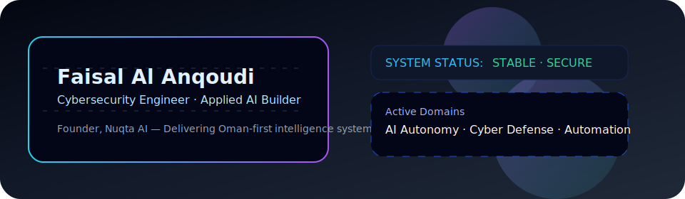

<!-- Faisal Al Anqoudi · Professional README -->

<p align="center">
  
</p>

<p align="center">
  <b>Cybersecurity Engineer · Applied AI Builder · Founder of Nuqta AI</b><br />
  Designing Oman-first intelligence systems that blend resilient cyber defense with measurable product impact.
</p>

<p align="center">
  <a href="mailto:faisal@nuqtai.com">Email</a> ·
  <a href="https://linkedin.com/in/anqoudi">LinkedIn</a> ·
  <a href="https://github.com/anqoudi">GitHub</a> ·
  <a href="https://nuqtai.com">Nuqta AI</a>
</p>

---

## Command Deck

- Leading **Nuqta AI**, an applied intelligence studio building multilingual copilots, WhatsApp agents, and automation layers for Omani enterprises.
- Cybersecurity Engineering student @ **Middle East College** with emphasis on threat intelligence, secure infrastructure, and red-team simulations.
- Delivering AI transformations for hackathons and national initiatives including **GeoTech**, **Wix Summit**, and **Injaz Oman**.
- Advocate for responsible AI deployment grounded in compliance, observability, and business KPIs.

---

## Strategic Focus

<table>
  <tr>
    <td width="33%" valign="top">
      <h4 align="center">AI Systems Delivery</h4>
      <p><strong>What:</strong> Retrieval-augmented copilots, sector-specific chatbots, autonomous workflows.<br /><strong>Stack:</strong> LangChain · OpenAI · Gemini · Supabase · n8n · Automapi.</p>
    </td>
    <td width="33%" valign="top">
      <h4 align="center">Cyber Defense Engineering</h4>
      <p><strong>What:</strong> Threat modeling, phishing simulations, incident playbooks, SOC automation.<br /><strong>Toolkit:</strong> Burp Suite · Nessus · Metasploit · Wireshark · Nmap.</p>
    </td>
    <td width="33%" valign="top">
      <h4 align="center">Product & Deployment</h4>
      <p><strong>What:</strong> Full-stack MVPs, SaaS control panels, hybrid cloud rollouts.<br /><strong>Enablers:</strong> Next.js · Tailwind · Docker · Vercel · Hostinger VPS.</p>
    </td>
  </tr>
</table>

---

## Signature Systems

| Initiative | Outcome | Core Technologies |
| --- | --- | --- |
| **Nuqta AI Control Center** | Unified SaaS delivering AI copilots, WhatsApp automation, and Omani Arabic UX for SMBs. | Next.js · LangChain · Supabase · n8n |
| **Dahih Conversational Agent** | Civic tourism chatbot answering questions on education, travel, and government services. | OpenAI · Automapi · WhatsApp Cloud API |
| **CyberMirror 2.0** | Phishing simulation suite with analytics for corporate awareness programs. | Flask · Python · SQLite · Docker |
| **Learnz Plus** | AI tutoring companion driving adaptive learning for institutes and students. | Expo · Firebase · Gemini API |
| **VibeCoding Workshops** | Rapid prototyping bootcamps enabling students to ship full-stack MVPs inside 48 hours. | React · Node.js · Supabase |

---

## Impact Snapshots

- 🥉 **GeoTech Innovation Challenge** – Delivered geospatial AI insights alongside Al-Ruya.
- 🏆 **Injaz Oman & Wix Summit 2025** – Showcased Nuqta AI omni-channel automation platform.
- 🤝 **Al-Anqa Space & Technologies** – Mentored on scaling secure AI venture delivery.
- 🎓 **Middle East College** – Cybersecurity Engineering, Class of 2025.

---

## Delivery Stack

<details open>
  <summary><strong>Languages & Frameworks</strong></summary>
  <p>Python · JavaScript · TypeScript · SQL · Bash · Next.js · React · Tailwind CSS.</p>
</details>

<details open>
  <summary><strong>AI & Automation</strong></summary>
  <p>LangChain · OpenAI API · Google Gemini · Supabase Vector · Automapi · n8n.</p>
</details>

<details open>
  <summary><strong>Cybersecurity Toolkit</strong></summary>
  <p>Burp Suite · Nessus · Metasploit · Wireshark · Nmap · Kali Linux.</p>
</details>

<details open>
  <summary><strong>Ops & Productivity</strong></summary>
  <p>Docker · Vercel · Hostinger VPS · GitHub Actions · Cursor AI · VS Code.</p>
</details>

---

## Activity Signals

<p align="center">
  
  
  
</p>

<p align="center">
  
</p>

> _Realtime badges are served from shields.io and Demolab streak stats with caching to avoid blank renders._

---

## Operating Principles

```json
{
  "identity": "Faisal Al Anqoudi",
  "roles": ["Cybersecurity Engineer", "Applied AI Founder"],
  "values": ["Secure-by-design", "Impact metrics", "Arabic-first experiences"],
  "seeking": "Alliances that demand measurable automation and resilient delivery"
}
```

```
> system.shutdown()
CONNECTION TERMINATED _
```
