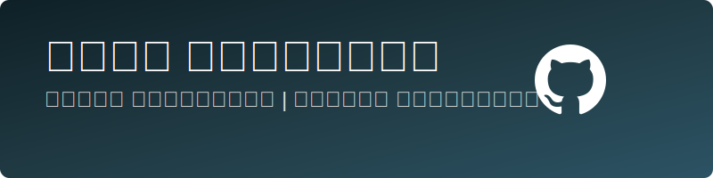

  
  
  

## 💼 نبذة عني
طالب متخصص في الأمن السيبراني مع شغف كبير بالذكاء الاصطناعي وتطبيقاته. أسعى لتطوير مهاراتي في مجال حماية المعلومات وتحليل الثغرات الأمنية، مع العمل على مشاريع مبتكرة تجمع بين الأمن السيبراني والذكاء الاصطناعي.

  

## 🔐 مهارات الأمن السيبراني

  
  
  
  
  
  
  

## 🤖 مهارات الذكاء الاصطناعي

  
  
  
  
  
  

## 💻 المهارات التقنية

  
  
  
  
  
  
  
  
  
  
  
  
  
  
  
  
  
  

## 🚀 المشاريع
### نظام كشف التهديدات المعتمد على الذكاء الاصطناعي
تطوير نموذج للكشف عن الهجمات السيبرانية باستخدام خوارزميات التعلم الآلي. يقوم النظام بتحليل أنماط حركة المرور على الشبكة للكشف عن السلوكيات المشبوهة والهجمات المحتملة في الوقت الفعلي.

### تحليل الثغرات الأمنية
أتمتة عمليات البحث عن الثغرات الأمنية في تطبيقات الويب باستخدام أدوات متقدمة وتقنيات اختبار الاختراق. يساعد المشروع في تحديد نقاط الضعف قبل أن يتمكن المهاجمون من استغلالها.

### تطبيق للأمن السيبراني
تطوير أداة لتقييم مستوى الأمان في الأنظمة والشبكات، مع تقديم توصيات لتحسين الوضع الأمني وسد الثغرات المحتملة.

## 📚 التعليم
- بكالوريوس في الأمن السيبراني (قيد الدراسة)
- شهادات في مجال الأمن السيبراني والذكاء الاصطناعي

## 📊 إحصائيات GitHub

  
  

---

  

⭐️ من [alanqoudif](https://github.com/alanqoudif)